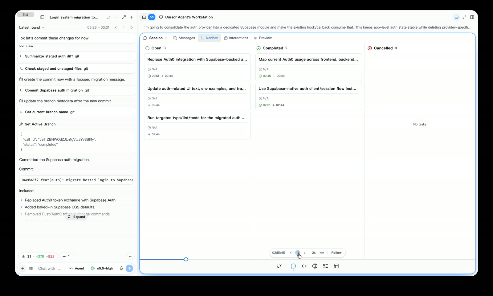
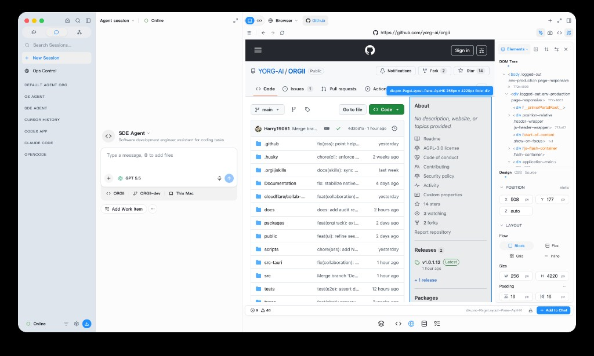

# ORG-II

ORGII is a self-evolving agentic development framework for coding with agents and Agentic Orgs.

- Lightweight Tauri + Rust architecture; < 100MB on disk.
- Rust agents that work with your existing API keys and agent subscriptions.
- Livestream and replay agent trajectories for auditing, review, and debugging.
- GUI compatible with both ORGII Rust and CLI agents.
- Local-first architecture with group issue and session collaboration via self-hosted Supabase (early stage).

Agents:

- Resource-aware, understanding system state (RAM, CPU, and human attention avialability).
- Agent-powered GUI end-to-end testing for supervised self-evolution.
- Cross-agent memory and knowledge sharing.
- AI blame system that attributes actions to the original agent and restores that agent in any new session.
- Designed for long-running agent sessions and organizational-scale development.

Built-in tools:

- Skills, MCPs, Plugins, Rules.
- Routine builder.
- Code Editor, LSP, Prolems, Terminal, Source control, Timeline, Git History, etc.
- Built-in browsers / element inspecors
- Database manager (early stage).

## Demo





https://github.com/user-attachments/assets/bd4833d2-4cc4-4971-9805-84529b14d01a

## Download

Get the latest ORGII desktop app from the [Releases](https://github.com/YORG-AI/ORGII/releases) page. Open the newest release, download the installer or app bundle for your platform, and follow the OS prompts to install ORGII.

## Develop from source

To build or contribute from source:

```bash
pnpm install
pnpm run download:sidecars
pnpm run tauri:dev
```

For more contribution details, see [CONTRIBUTING.md](CONTRIBUTING.md). We ask everyone to be respectful and empathetic; see [CODE_OF_CONDUCT.md](CODE_OF_CONDUCT.md).

## Optional native sidecars

Browser Use and Computer Use features rely on optional native helpers for browser automation and macOS screen automation:

- `agent-browser` is downloaded from `vercel-labs/agent-browser` releases for the current OS/CPU.
- `peekaboo` is downloaded from `steipete/peekaboo` releases on macOS.

Computer Use is currently available on macOS only. Browser Use can use `agent-browser` on supported platforms.

If a sidecar is missing, the Rust build creates a small placeholder resource so development builds can continue. The related capability may fall back to `PATH` or remain unavailable until you run `pnpm run download:sidecars`.

## License

ORGII is licensed under the GNU Affero General Public License v3.0 or later (`AGPL-3.0-or-later`). See [`LICENSE`](LICENSE) for the full license text.
