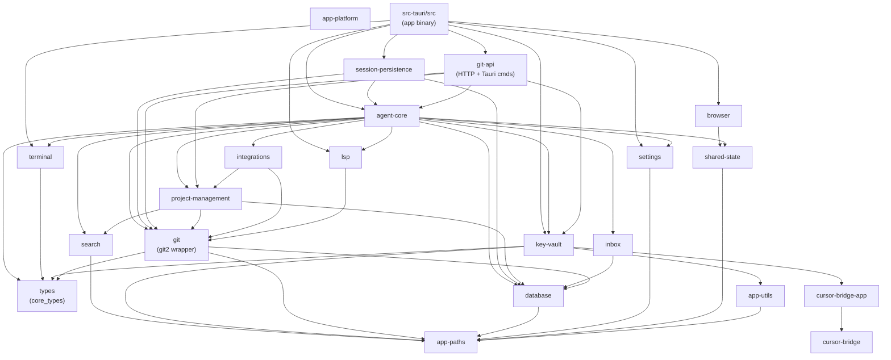

# Rust Crates Architecture

> Last updated: 2026-06-12

All Rust code lives under `src-tauri/`. The workspace is declared in
`src-tauri/Cargo.toml` and contains the root application crate (`src-tauri/src/`)
plus ~40 library crates under `src-tauri/crates/`.

---

## Crate Dependency Graph

The diagram shows the major dependency edges. Leaf / utility crates (`app-paths`,
`app-utils`, `types`) are depended on by nearly everything and are omitted from
most arrows to keep the graph readable; they are listed separately below.

---

## Crate Descriptions

### Foundation / Shared

| Crate          | Lib name       | Purpose                                                                                         |
| -------------- | -------------- | ----------------------------------------------------------------------------------------------- |
| `types`        | `core_types`   | Shared domain types and traits used across the entire workspace. No business logic.             |
| `app-paths`    | `app_paths`    | Resolves platform-specific filesystem paths (`~/.orgii/`, app data dir, log dir).               |
| `app-utils`    | `app_utils`    | Small cross-cutting utilities (error helpers, async utilities, OS detection).                   |
| `app-platform` | `app_platform` | macOS / Windows platform-specific integrations (NSApp, DWM, tray, power events).                |
| `app-window`   | `app_window`   | Native window decoration helpers (traffic lights, rounded corners, vibrancy).                   |
| `settings`     | `settings`     | User and workspace settings CRUD backed by JSON files.                                          |
| `shared-state` | `shared_state` | `Arc<Mutex<…>>` singletons shared across Tauri commands (browser controller, screenshot store). |
| `perf-utils`   | `perf_utils`   | Lightweight instrumentation / timing utilities for hot paths.                                   |
| `test-helpers` | `test_helpers` | Fixture builders and in-process mocks for use in `#[cfg(test)]` blocks.                         |
| `transport`    | `transport`    | Async HTTP and WebSocket client abstractions used by agent and sync layers.                     |

### Data / Storage

| Crate                 | Lib name              | Purpose                                                                  |
| --------------------- | --------------------- | ------------------------------------------------------------------------ |
| `database`            | `database`            | SQLite via `rusqlite`; migrations, pooling, and typed query helpers.     |
| `session-persistence` | `session_persistence` | Persists agent session events to SQLite; read-back, cleanup, and export. |
| `inbox`               | `inbox`               | Notification inbox: stores and queries in-app notification rows.         |

### VCS / File System

| Crate             | Lib name          | Purpose                                                                                                            |
| ----------------- | ----------------- | ------------------------------------------------------------------------------------------------------------------ |
| `git`             | `git`             | Low-level `git2`-backed operations: status, diff, log, stash, commit, branch ops.                                  |
| `git-api`         | `git_api`         | Axum HTTP router exposing git operations as REST endpoints. Also owns the `generate_commit_message` Tauri command. |
| `file-ops`        | `file_ops`        | Safe file read/write/move operations used by agents and the editor.                                                |
| `search`          | `search`          | Ripgrep-backed code search and `list_dir`. Powering agent `code_search` tool calls.                                |
| `advanced-search` | `advanced_search` | Semantic / embedding-augmented search (vector index over workspace files).                                         |
| `ui-indexer`      | `ui_indexer`      | Watches the workspace and maintains an in-process symbol + file index for fast autocomplete.                       |

### Agent Runtime

| Crate          | Lib name       | Purpose                                                                                                                                                                                                                 |
| -------------- | -------------- | ----------------------------------------------------------------------------------------------------------------------------------------------------------------------------------------------------------------------- |
| `agent-core`   | `agent_core`   | **Central agent runtime.** LLM provider abstraction, model context, tool registry, turn execution loop, session management, prompt builders, memory, skills, MCP client, plugins, automation, and channel integrations. |
| `agent-cli`    | `agent_cli`    | Thin binary entry-point for the headless CLI agent (`orgii-agent`). Delegates to `agent_core`.                                                                                                                          |
| `key-vault`    | `key_vault`    | LLM provider key CRUD, OAuth capture flows, and per-provider validation. Tauri commands are registered directly (not via shell shim).                                                                                   |
| `integrations` | `integrations` | Third-party service adapters (GitHub, Slack, Linear, Jira, …).                                                                                                                                                          |

### IDE / Tooling

| Crate                | Lib name             | Purpose                                                                                                                                                                                                              |
| -------------------- | -------------------- | -------------------------------------------------------------------------------------------------------------------------------------------------------------------------------------------------------------------- |
| `terminal`           | `terminal`           | PTY session management (front-side Tauri commands) and agent-side LLM tool plumbing for shell execution.                                                                                                             |
| `lsp`                | `lsp`                | Spawns and supervises external LSP servers (rust-analyzer, tsserver, pyright, gopls), parses `textDocument/publishDiagnostics`, and forwards diagnostics to the frontend WebSocket. Also owns the lint-tool catalog. |
| `project-management` | `project_management` | Workspace / project metadata (repo detection, language detection, dependency parsing).                                                                                                                               |

### Browser / UI Automation

| Crate               | Lib name            | Purpose                                                                                                                                |
| ------------------- | ------------------- | -------------------------------------------------------------------------------------------------------------------------------------- |
| `browser`           | `browser`           | Native window browser management, inline WebView embedding, DOM editing, screenshot capture, cookie access, and anti-bot JS injection. |
| `cursor-bridge`     | `cursor_bridge`     | Drives a running Cursor IDE instance over Chrome DevTools Protocol (CDP) to submit prompts without leaving the app.                    |
| `cursor-bridge-app` | `cursor_bridge_app` | Thin companion binary (`cursor-bridge-probe`) for the `cursor-bridge` library.                                                         |
| `db-browser`        | `db_browser`        | In-app SQLite browser for developer introspection of local databases.                                                                  |
| `db-clients`        | `db_clients`        | Client adapters for external databases (PostgreSQL, MySQL) accessed from agent tool calls.                                             |

### System / Platform

| Crate             | Lib name          | Purpose                                                                                                     |
| ----------------- | ----------------- | ----------------------------------------------------------------------------------------------------------- |
| `system-services` | `system_services` | macOS system integrations (Spotlight, notifications, power assertions, audio) and cross-platform clipboard. |
| `container`       | `container`       | OCI container management for sandboxed agent execution (Docker / Podman).                                   |

### Developer / Testing

| Crate                    | Lib name      | Purpose                                                                        |
| ------------------------ | ------------- | ------------------------------------------------------------------------------ |
| `e2e-test`               | `e2e_test`    | End-to-end test harness — drives a full `agent_core` session programmatically. |
| `test-runner`            | `test_runner` | In-process test runner utilities for headless CI runs against the agent.       |
| `bin-gateway-chat-cli`   | _(binary)_    | CLI smoke-test binary for the LLM gateway layer.                               |
| `bin-provider-key-check` | _(binary)_    | CLI utility to verify provider API key validity against live endpoints.        |
| `bin-telegram-smoke`     | _(binary)_    | Smoke-test binary for the Telegram integration.                                |

---

## The Root Application Crate (`src-tauri/src/`)

`src-tauri/src/` is the `app` crate — the binary that Tauri compiles into the
final desktop application. It is **not a library** exposing its own public API;
instead it:

1. **Wires crate command surfaces** — `handler_list.inc` re-exports every
   `#[tauri::command]` from each domain crate so they can be registered in one
   `generate_handler!` call.
2. **Owns the event-store ingestion layer** — `src/event_store/ingestion/` holds
   the Rust-side session event normalizer (`normalizer.rs`,
   `consolidator.rs`, `tool_call_merger.rs`) that converts raw
   `ActivityChunk` payloads into `SessionEvent` records. The frontend calls
   this exclusively via `es_process_chunks` / `es_normalize_chunk` Tauri IPC.
3. **Owns high-level Tauri setup** — window creation, tray icon, deep-link
   handling, IPC channel registration, and app lifecycle hooks.

---

## Public API vs Internal Crates

These crates expose a stable-ish surface consumed by `agent_core` or the
`app` binary and are treated as "semi-public":

- `agent_core` — the central orchestrator; its public types appear in Tauri
  command signatures visible to the frontend.
- `git_api` — its Axum router is composed into the shared HTTP listener.
- `key_vault` — its Tauri commands are registered in `handler_list.inc`.
- `terminal` — its Tauri commands are registered in `handler_list.inc`.
- `types` (`core_types`) — by design fully public; consumed across the
  workspace.

All other crates are internal implementation details. The workspace uses
`publish = false` on every crate — nothing is published to crates.io.

---

## Naming Conventions

See `src-tauri/src/CONVENTIONS.md` for the full reference. Key points:

- Constants: `MAX_*`, `DEFAULT_*`, `*_TIMEOUT_SECS`, `*_DELAY_MS`.
- Env vars: `ORGII_` prefix, `SCREAMING_SNAKE_CASE`.
- Duration constants carry explicit unit suffixes (`_SECS`, `_MS`).
