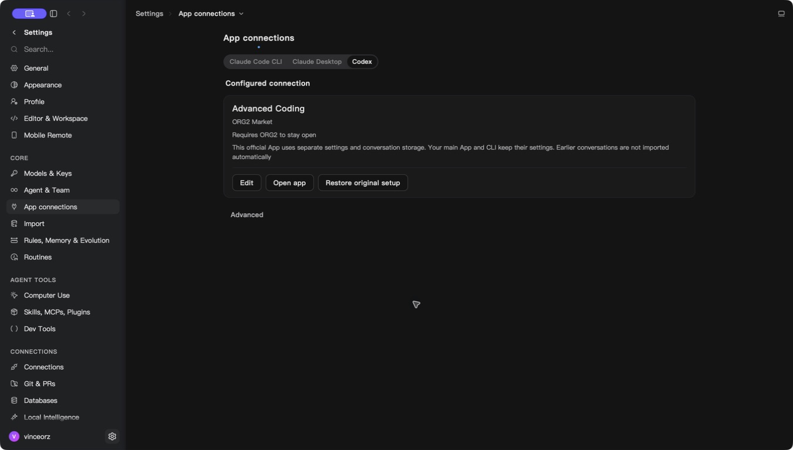

# Market app compatibility and model selection

## Behavior

Codex Desktop 26.915.31945 is accepted alongside the previously verified
26.908.70816. Bundle identity checks remain mandatory, and unknown releases
remain blocked. An unsupported release now produces a localized update message
instead of the generic connection error. Arbitrary native error text is never
shown to the user.

Managed model compatibility follows the server's `clients` capabilities rather
than inferring client support from the provider wire protocol. GPT can appear
for Claude clients only after the companion Cloud protocol bridge advertises
that support. Older servers retain their existing model availability. The companion bridge is [Cloud PR #126](https://github.com/org2AI/ORGII-cloud-infra/pull/126) and must deploy before relying on GPT compatibility. This PR does not implement or deploy the gateway bridge.

Selecting a model previously fetched the whole package catalog again after the
picker had loaded it. Session preparation now reuses its native-validated
snapshot for at most 30 seconds. Explicit catalog refresh still fetches current
data. Refresh failure, activation and reauthorization invalidate the snapshot.
This snapshot supplies selection metadata only: token issuance and gateway
requests continue to enforce access, terms, funds and availability.

## Executed verification

The following checks ran on this branch before its final integration rebase:

- `pnpm test src/features/MarketConnect/externalAppBridge.test.ts src/features/MarketConnect/nativeModelSelection.test.ts src/modules/MainApp/Settings/sections/HarnessConnections/AppConnectionPage.test.ts`: 25 tests passed.
- `pnpm typecheck:fast`: passed.
- Changed-file ESLint and `pnpm check:i18n-keys`: passed.
- `pnpm run build --no-cache`: passed.
- `cargo test --manifest-path src-tauri/Cargo.toml -p org2 --lib market_connection::native_app_launch::tests -- --nocapture`: 4 passed.
- `cargo test --manifest-path src-tauri/Cargo.toml -p market-connect workspace::tests -- --nocapture`: 3 passed.
- `cargo test --manifest-path src-tauri/Cargo.toml -p org2 --lib market_connection::source::tests -- --nocapture`: 21 passed. The new loopback HTTP test verifies concurrent selections issue one request, explicit refresh reaches the server, a failed refresh cannot revive an earlier snapshot, and expiry triggers a new fetch. Separate tests verify logout, late responses and owner isolation.
- An earlier build with the same compatibility implementation started a separate Codex Desktop 26.915.31945 process. The final combined build `aff4fd0` completed Advanced Coding configuration using the actual ORG2 **Use connection** control and the **Restore** UI operation; it did not launch a separate Codex process during that final check. SHA-256 hashes of all four monitored primary Codex configuration/authentication files remained unchanged. The screenshot below comes from this final build and records the configured state; it does not prove a model inference call from the official Codex UI.

The installed release's bootstrap and main sources were audited for
`CODEX_ELECTRON_USER_DATA_PATH`, `CODEX_HOME` and isolated single-instance
behavior. Relevant source SHA-256 values:

- Bootstrap: `5787d416ccbd7be549251d2c691f9c2579d6960f3ccd470037d97486c93fdf0f`
- Main: `9e8a3bd79c817064f28693ca26aa1378895e07ab2108c78c42d0ea20dac9d66e`

## Limits and lifecycle

Claude Desktop's GPT menu and real inference through the new capability catalog
have not been verified. The Cloud bridge has separate protocol, provider and
billing acceptance. Neither result substitutes for native desktop acceptance.
The integration acceptance build combined the fixes at commit `aff4fd0` (native
binary SHA-256 prefix `332c077`). Keychain access initially blocked cold package
loading; a process sample identified `enabled::status →
keyring::Entry::get_password → Security decrypt`. The user then authorized
Keychain access and the native picker loaded. In the SDE Advanced Coding picker,
warm Fable → GPT6 Astra selection and confirmation took 464 ms; returning to
Fable took 455 ms. These are observed automation round-trip upper bounds for two
actions, not a p95 measurement or a before/after performance comparison.
Official Codex UI model inference remains unverified.

Resource samples used changes in cumulative process CPU time over measured
monotonic intervals, not the instantaneous `ps %cpu` field. CPU percentages below
are fractions of one core. RSS is end-of-interval residency; sums can include
shared pages. ORG2 had no direct child processes; launchd-owned WebKit processes
could not be attributed and are excluded.

| State (UTC, 2026-09-21)     | Interval | ORG2 CPU / RSS    | Isolated Claude process tree CPU / RSS |
| --------------------------- | -------- | ----------------- | -------------------------------------- |
| Foreground idle, 06:32:21   | 12.050 s | 0.50% / 167.7 MiB | 0.83% / 1035.3 MiB                     |
| After AX minimize, 06:37:47 | 12.043 s | 0.25% / 454.2 MiB | 0.66% / 886.8 MiB                      |

Model selection and other interactions occurred between the samples. These RSS
values do not establish a memory regression or improvement caused by hiding.
Claude's sampled process was independently identified as using the isolated
native-app profile. Both observations show low CPU during those short idle
intervals; they do not measure sustained or whole-system idle overhead.

Normal Quit required confirmation in ORG2's native quit dialog. Before the
confirmation, ORG2 correctly remained alive with its loopback listeners; this
was not treated as a shutdown failure. After confirmation, the original ORG2
process and the entire previously recorded Claude process tree were absent at
both ends of a 10.028-second observation starting 06:41:18 UTC. The former package
proxy port 17888 had no listener. ORG2 was reopened during that observation and
the new process owned port 13847 at the end, so an empty interval on that port
was not captured. No claim is made that reopening and resource sampling proved
all external service or WebKit cleanup.
The localized unsupported-version error has regression coverage but no rendered
error-state screenshot. No layout or control presentation was changed.

| Area            | Evidence                                                                                              | Decision                                             |
| --------------- | ----------------------------------------------------------------------------------------------------- | ---------------------------------------------------- |
| Background work | No timer, polling or new subscription                                                                 | Check freshness only on user-driven reads            |
| Memory          | One snapshot per existing connection; registry cap 32; catalog cap 100 packages                       | Bounded retention; reauthorization clears state      |
| Scope           | Existing instance-local source, owner/workspace identity and lease barriers; fixed build-time origins | Cached data cannot cross owner changes               |
| Hot path        | Three concurrent reads issue one HTTP request; explicit refresh remains fresh                         | Reuse only recent native-verified selection metadata |

**Performance verdict: targeted warm selection and visible/hidden idle checks
completed, with the measurement limits above.** Unit and HTTP request-count
checks passed. No statistically established latency improvement is claimed. Cold loading still
requires authorization and the remote catalog; this change does not claim to
remove that necessary work. Debug logs expose only `cache_hit` and `elapsed_us`
for catalog timing, with no buyer identity, selected model or credential.

Rollback uses the prior native build; this change has no schema migration or
new persistent profile format. Rolling back the companion Cloud capability
advertisement causes native validation to hide or reject unsupported models.
No installer was published and no production service was deployed by this PR.
